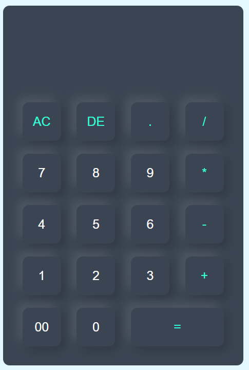

# Calculator Project

A simple calculator built using **HTML, CSS, and JavaScript**.  
It performs basic arithmetic operations like addition, subtraction, multiplication, and division.

## Project Preview
Here’s a quick look at the calculator UI 👇

## Features
- Clean UI with modern design  
- Fully functional buttons  
- Responsive layout  
- Real-time display updates  

## Tech Stack
- HTML  
- CSS  
- JavaScript

## How to Use
1. Open `index.html` in your browser.  
2. Click the buttons to perform calculations.  
3. Press **AC** to clear and **DE** to delete a single character.  
